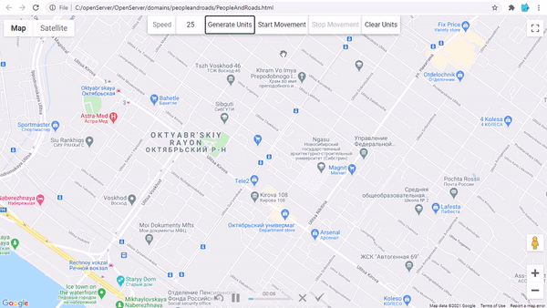

# SDS (Simulation of distributed systems) Coursework(3rd year) GoogleMapsAPI "People-And-Roads"
## Table of contents
* [General info](#general-info)
* [EN language](#en-language)
  * 
  * 
  * [Before launch](##before-launch)
* [RU language](#ru-language)
  * [Перед запуском](#перед-запуском)
  * [Задание к работе](#задание-к-работе)
  * [План работы](#план-работы)
## General info
### Developers
* [Ekaterina Ugolnikova](https://github.com/GiekoOlis)
* [Vlada Kogustova](https://github.com/SLADKAY-KISA)

3rd year students of SibSUTIs university

### Languages
* JavaScript
* HTML

### Preview

## EN language
	
### Before launch
Before the launch this project, you should follow these steps:
- in the file "PeopleAndRoads.html" on the 8th line, instead of "YOUR_KEY", enter your Google Maps API key
- activate the following APIs on your Google Maps API key:
  - Maps JavaScript API
  - Roads API

## RU language

### Перед запуском
Перед запуском этого проекта вам стоит выполнить следующие действия:
- в файле "PeopleAndRoads.html" в 8 строке вместо "YOUR_KEY" вписать свой Google Maps API ключ
- активировать на своем Google Maps API ключе следующие APIs:
  - Maps JavaScript API
  - Roads API

### Задание к работе
Требуется разработать web-страницу, отображающую карту местности. На карте необходимо случайным образом отрисовать абонентские устройства (UE). Абонентские устройства могут двигаться, могут стоять на месте. Абонентские устройства могут передвигаться только по дорогам.

### План работы
- Создать Web-страницу c картой (yandex || google || openstreetmap).
- Создать несколько абонентов (минимум 10) и отобразить их на карте (маркеры\картинки\схема).
- Абоненты должены двигаться только по дорогам (изменение координат абонентов относительно времени).
- Шаг изменения координат зависит от скорости абонента.
- 50% абонентов должны ходить со скоростью от 3 до 7 км\ч, 50% абонентов со скоростью от 30 до 70 км\ч.
- Составить отчет (с документированным кодом). Код должен быть в Приложении (в конце отчета).

### Краткое описание реализации

